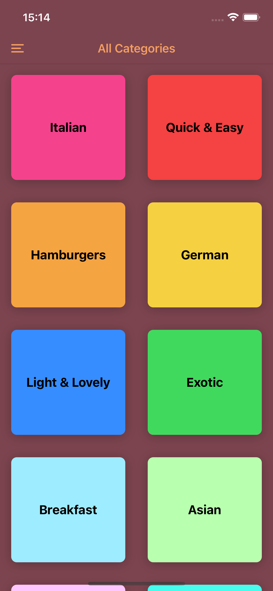
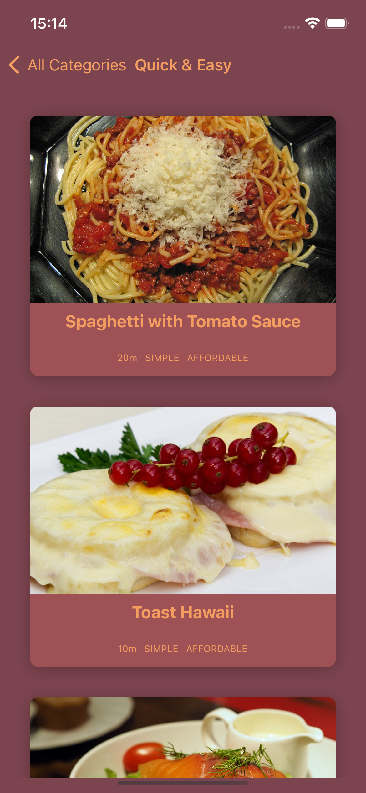
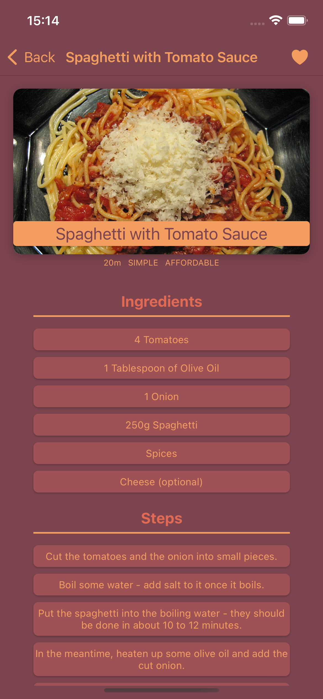
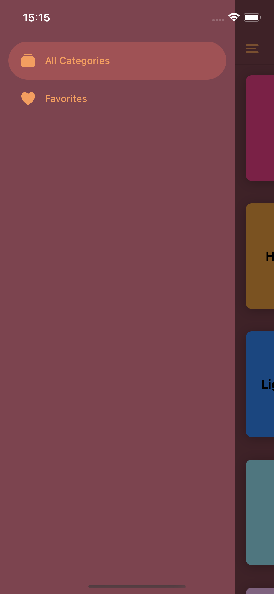
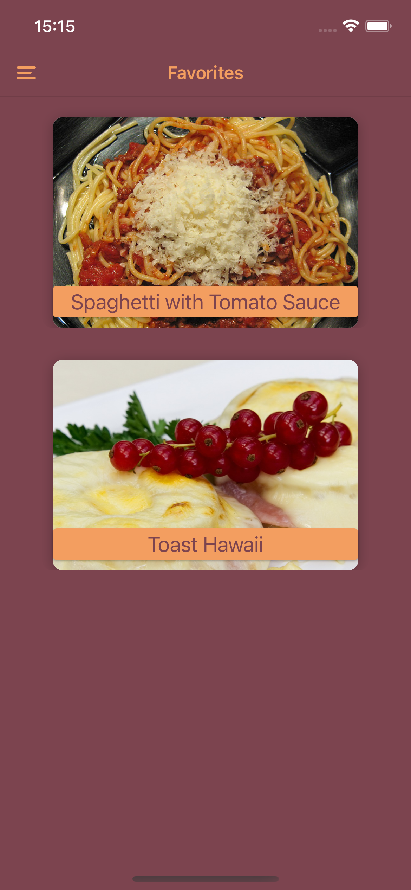

# Food Recipe Application

Welcome to the Food Recipe Application! This application allows you to explore various recipes and manage your favorite recipes by adding or removing them from your favorites list.

## Features

- **Explore Recipes**: Browse through a wide range of recipes.
- **Favorites Management**: Add or remove recipes from your favorites list for easy access.

## Screenshots

Here are some screenshots of the application to give you a better idea of its functionality:

|  |  |  |
|--------------------------------|--------------------------------|--------------------------------|
|  |  |  |

## Installation

To get started with the Food Recipe Application, follow these steps:

```sh
$ npm install
$ npm start

# test it on iOS or android simulator
```

## Usage

- **Explore Recipes**: Use the search functionality to find recipes based on ingredients, cuisine, or meal type.
- **Add to Favorites**: Click on the heart icon to add a recipe to your favorites list.
- **Remove from Favorites**: Click on the heart icon again to remove a recipe from your favorites list.

Happy Cooking!
